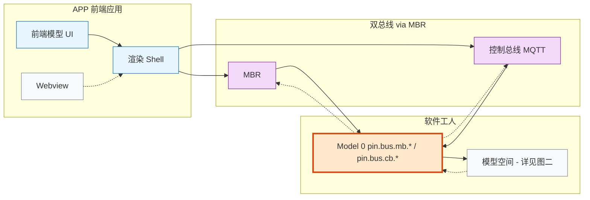
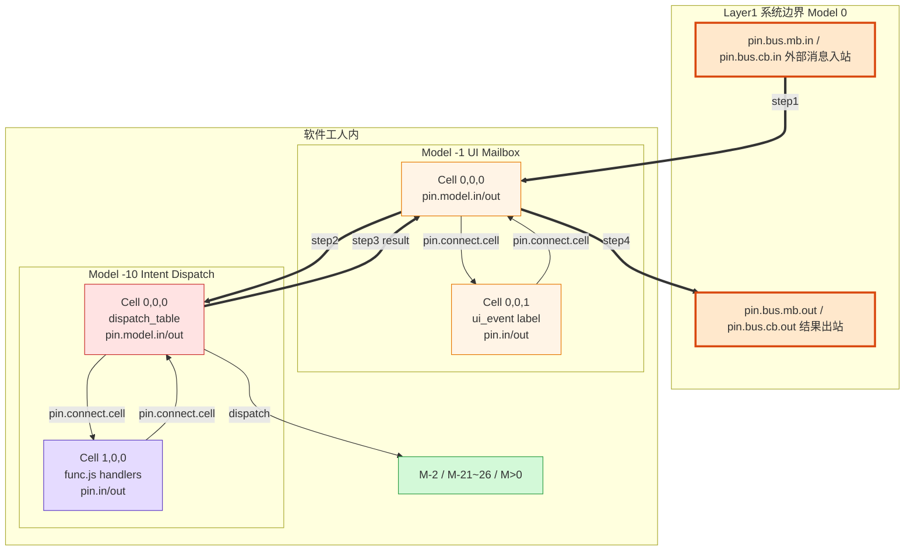

# UI 模型 Pin 路由架构

## 概述

本文档描述前端应用（APP）与软件工人内部 UI 模型之间的完整消息链路，以及基于 0356 PIN 连接合同的目标架构。

> 0356 后不再使用 `pin.connect.model`。跨模型段必须通过 `model.submt` hosting Cell 的边界引脚、子模型 root `(0,0,0)` 的边界引脚，以及所在模型内的 `pin.connect.cell` 表达。

Authority:
- Below `CLAUDE.md`, architecture SSOT, runtime semantics, label registry, PIN connection contract, and temporary payload contract.
- This file describes UI model routing architecture and migration targets; it does not override runtime or PIN contracts.

Scope:
- UI model message routing, current direct/hardcoded route debt, and target declaration-driven PIN routing architecture.

Conflict behavior:
- If current implementation language conflicts with target contract language, mark the section as current state or target state explicitly.
- If another doc restores direct UI bus side effects, update it or mark it historical.

**当前状态**：UI 事件链路通过 `submitEnvelope()` 硬编码路由（server.mjs 300+ 行特判），未使用 Pin 声明式路由。
**目标状态**：所有 UI 模型间通信通过 `pin.connect.cell` 与各模型内部 `pin.connect.label` 声明完成，路由拓扑完全 Tier 2 化。

## 图一：系统全景

> 修正要点：运行时基座**包裹**模型空间（不是与模型并列）；Model 0 是唯一外部入口；实线 = 请求路径，虚线 = 返回路径。



### 图例

| 颜色 | 含义 |
|------|------|
| 橙色（粗边框） | Model 0 系统边界 |
| 黄色 | M-1 UI Mailbox |
| 红色 | M-10 Intent Dispatch |
| 紫色 | M-2 Editor State |
| 青色 | Page Asset 模型 |
| 绿色 | 用户模型 |
| 蓝色 | 渲染 Shell |
| 实线 | 请求路径（前端 → 工人） |
| 虚线 | 返回路径（工人 → 前端） |

### 与原图的关键修正

| 问题 | 原图 | 修正 |
|------|------|------|
| 前端模型基座位置 | 在 UI 模型**内部**，与 M1-M4 并列 | 基座是**解释器**，应包裹所有模型 |
| 系统边界 | 无 Model 0，In/Out 直接挂在 UI 模型上 | Model 0 (0,0,0) 是唯一外部入口 |
| In/Out 端口 | 泛称 In\_1/In\_2/Out\_1/Out\_2 | 系统边界应使用 `pin.bus.mb.*` / `pin.bus.cb.*`，模型内部使用 `pin.in` / `pin.out` |
| M1-M4 | 无具体含义 | 应为具体模型 ID（-1, -2, -10 等） |
| 返回路径 | 无 | 完整回路可见 |
| 层次 | 无 3 层连接架构 | Layer 1/2/3 分层可见 |

---

## 图二：软件工人内部 3 层 Pin 路由详图

> 粗线（==>）标示完整 round-trip 主路径。子图内细线为模型内部 pin.connect.cell 路由。



### 完整 Round-trip 路径

| Step | 路径 | Pin 类型 | 连接层 |
|------|------|---------|--------|
| step1 | Model 0 bus\_in → M-1 hosting Cell → M-1 (0,0,0) | pin.connect.cell + model.submt boundary | Layer 2 |
| — | M-1 (0,0,0) → M-1 (0,0,1) mailbox | pin.connect.cell | Layer 3 |
| — | M-1 (0,0,1) event 处理 → M-1 (0,0,0) | pin.connect.cell | Layer 3 |
| step2 | M-1 root → M-10 hosting Cell → M-10 (0,0,0) dispatch | pin.connect.cell + model.submt boundary | Layer 2 |
| — | M-10 (0,0,0) → M-10 (1,0,0) handler | pin.connect.cell | Layer 3 |
| — | M-10 (1,0,0) func.js 执行 → M-10 (0,0,0) | pin.connect.label + pin.connect.cell | Layer 3 |
| step3 | M-10 root result → M-1 hosting/root boundary | pin.connect.cell + model.submt boundary | Layer 2 |
| step4 | M-1 root → Model 0 bus\_out | pin.connect.cell + model.submt boundary | Layer 2 |

---

## 当前实现 vs 目标架构差距

### 当前状态（非合规）

UI 事件链路绕过 Pin 系统，通过 `submitEnvelope()` 硬编码路由：

```
HTTP POST /ui_event
  → addLabel(M-1, 0,0,1, ui_event)        // 直接写 label，未进入 split bus
  → processEventsSnapshot() 特判检测       // 硬编码 model_id === -1 检查
  → event_trigger_map 查找                 // 直接读 M-10 label，无跨模型 pin 链
  → intent_dispatch_table 查找             // 同上
  → handler 执行                           // 直接调用，无 pin.connect.cell
  → HTTP response                          // 直接返回，未进入 split bus out
```

### 需要补齐的 Pin 声明

| 模型 | Cell | 需新增的 Pin 声明 |
|------|------|-------------------|
| Model 0 | (0,0,0) | `pin.bus.mb.in` / `pin.bus.mb.out`（UI/管理类）；需要控制类时使用 `pin.bus.cb.in` / `pin.bus.cb.out` |
| Model -1 | (0,0,0) | pin.in: ui\_msg\_in, pin.out: dispatch\_out, bus\_reply |
| Model -1 | (0,0,1) | pin.in: event\_in, pin.out: event\_out |
| Model -1 | (0,0,0) | pin.connect.cell: (0,0,0)→(0,0,1), (0,0,1)→(0,0,0) |
| Model -10 | (0,0,0) | pin.in: dispatch\_in, pin.out: result\_out |
| Model -10 | (1,0,0) | pin.in: handler\_in, pin.out: handler\_out |
| Model -10 | (0,0,0) | pin.connect.cell: (0,0,0)→(1,0,0), (1,0,0)→(0,0,0) |
| 跨模型 | — | `model.submt` hosting Cell 边界引脚 + 所在模型内 `pin.connect.cell` |

### 迁移影响

- **Tier 1 变更**：无。`_applyBuiltins()` 和 `_propagateCellConnect()` 已实现 pin 路由引擎。
- **Tier 2 变更**：新增上述 pin 声明（JSON patch）。
- **server.mjs 变更**：`submitEnvelope()` 中的硬编码路由逻辑可逐步替换为 pin 路由调用。
- **前置条件**：Pin 工具（引脚连接 UI）完成后，此迁移才能在界面上可操作。

---

## 相关文档

- [[docs/ssot/runtime_semantics_modeltable_driven|运行时语义 SSOT]]
- [[docs/ssot/ui_to_matrix_event_flow|UI 事件到 Matrix 流转机制]]
- [[docs/plans/2026-02-11-pin-isolation-and-model-hierarchy-design|Pin 隔离与模型层级设计]]
- [[docs/ssot/label_type_registry|Label 类型注册表]]
- [[docs/ssot/tier_boundary_and_conformance_testing|Tier 边界与合规测试]]
