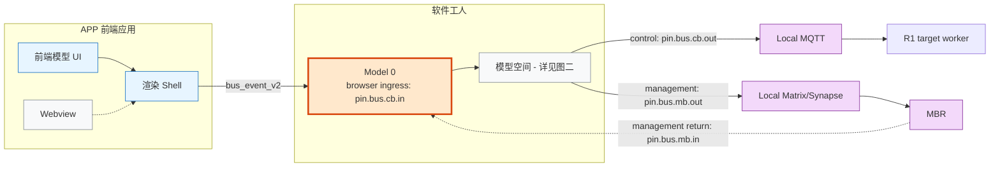
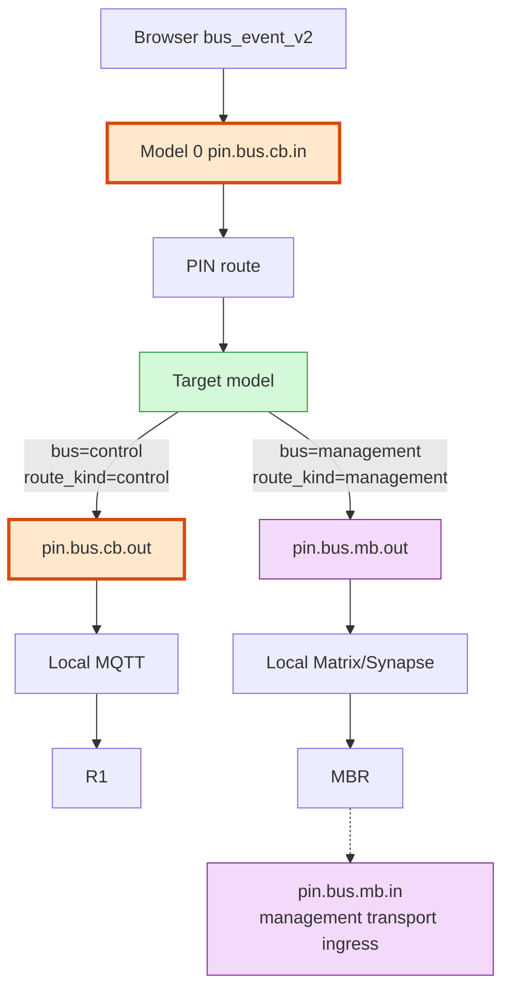

# UI 模型 Pin 路由架构

## 概述

本文档描述前端应用（APP）与软件工人内部 UI 模型之间的完整消息链路，以及基于 0356 PIN 连接合同的目标架构。

> 0356 后不再使用 `pin.connect.model`。0431 后，跨模型段必须通过父侧 `model.submtconnection` Cell boundary pins、子模型 root `(0,0,0)` boundary pins，以及所在模型内的 `pin.connect.cell` 表达。`model.submt` 只负责 child 侧身份声明，不是 route / wiring path 的一段。

Authority:
- Below `CLAUDE.md`, architecture SSOT, runtime semantics, label registry, PIN connection contract, and temporary payload contract.
- This file describes the current UI model routing architecture and declaration boundaries; it does not override runtime or PIN contracts.

Scope:
- Current browser ingress, target-model routing, transport egress, and declaration-driven PIN boundaries.

Conflict behavior:
- If current implementation language conflicts with target contract language, mark the section as current state or target state explicitly.
- If another doc restores direct UI bus side effects, update it or mark it historical.

**当前状态**：所有浏览器 `bus_event_v2` 都先进入 Model 0 的 `pin.bus.cb.in`，再由 ModelTable 中的 PIN 连接进入目标模型。浏览器不能直接选择 management ingress。
**声明目标**：模型内部通信使用 `pin.connect.cell` / `pin.connect.label`，跨模型通信使用父侧 `model.submtconnection` boundary pins、子模型 root boundary pins 与所在模型内的 `pin.connect.cell`；路由拓扑保持 Tier 2 化。

## 图一：系统全景

> 修正要点：运行时基座**包裹**模型空间（不是与模型并列）；Model 0 是唯一外部入口；实线 = 请求路径，虚线 = 返回路径。

```mermaid
graph LR
    subgraph app["APP 前端应用"]
        fm["前端模型 UI"]
        shell["渲染 Shell"]
        wv["Webview"]
        fm --> shell
        wv -.-> shell
    end

    subgraph sw["软件工人"]
        m0["Model 0<br/>browser ingress: pin.bus.cb.in"]
        ms["模型空间 - 详见图二"]
    end

    ctrl["Local MQTT"]
    r1["R1 target worker"]
    matrix["Local Matrix/Synapse"]
    mbr["MBR"]

    shell -->|"bus_event_v2"| m0
    m0 --> ms
    ms -->|"control: pin.bus.cb.out"| ctrl
    ctrl --> r1
    ms -->|"management: pin.bus.mb.out"| matrix
    matrix --> mbr
    mbr -.->|"management return: pin.bus.mb.in"| m0

    style m0 fill:#ffe8cc,stroke:#d9480f,stroke-width:3px,color:#333
    style ms fill:#f8f9fa,stroke:#868e96,color:#333
    style shell fill:#e7f5ff,stroke:#1971c2,color:#333
    style fm fill:#e7f5ff,stroke:#1971c2,color:#333
    style wv fill:#f8f9fa,stroke:#868e96,color:#333
    style mbr fill:#f3d9fa,stroke:#862e9c,color:#333
    style matrix fill:#f3d9fa,stroke:#862e9c,color:#333
    style ctrl fill:#f3d9fa,stroke:#862e9c,color:#333
```

### 图例

| 颜色 | 含义 |
|------|------|
| 橙色（粗边框） | Model 0 系统边界 |
| 绿色 | 用户模型 |
| 蓝色 | 渲染 Shell |
| 实线 | 请求路径（前端 → 工人） |
| 虚线 | 返回路径（工人 → 前端） |

### 与原图的关键修正

| 问题 | 原图 | 修正 |
|------|------|------|
| 前端模型基座位置 | 在 UI 模型**内部**，与 M1-M4 并列 | 基座是**解释器**，应包裹所有模型 |
| 系统边界 | 无 Model 0，In/Out 直接挂在 UI 模型上 | Model 0 (0,0,0) 是唯一外部入口 |
| In/Out 端口 | 泛称 In\_1/In\_2/Out\_1/Out\_2 | 浏览器统一进入 `pin.bus.cb.in`；目标模型外发才在 `pin.bus.cb.out` 与 `pin.bus.mb.out` 之间选择 |
| M1-M4 | 无具体含义 | 应为具体模型 ID（-1, -2, -10 等） |
| 返回路径 | 无 | 完整回路可见 |
| 层次 | 无 3 层连接架构 | Layer 1/2/3 分层可见 |

---

## 图二：当前浏览器入口与 transport egress

> 浏览器入口与 transport egress 是两个阶段。入口始终是 control ingress；只有目标模型外发记录可以选择 management。

```mermaid
flowchart TB
    browser["Browser bus_event_v2"] --> cb_in["Model 0 pin.bus.cb.in"]
    cb_in --> route["PIN route"]
    route --> target["Target model"]
    target -->|"bus=control<br/>route_kind=control"| cb_out["pin.bus.cb.out"]
    cb_out --> mqtt["Local MQTT"]
    mqtt --> r1["R1"]
    target -->|"bus=management<br/>route_kind=management"| mb_out["pin.bus.mb.out"]
    mb_out --> matrix["Local Matrix/Synapse"]
    matrix --> mbr["MBR"]
    mbr -.-> mb_in["pin.bus.mb.in<br/>management transport ingress"]

    style cb_in fill:#ffe8cc,stroke:#d9480f,stroke-width:3px,color:#333
    style cb_out fill:#ffe8cc,stroke:#d9480f,stroke-width:3px,color:#333
    style mb_out fill:#f3d9fa,stroke:#862e9c,color:#333
    style mb_in fill:#f3d9fa,stroke:#862e9c,color:#333
    style target fill:#d3f9d8,stroke:#2f9e44,color:#333
```

### 当前完整路径

| Step | 路径 | Pin 类型 | 连接层 |
|------|------|---------|--------|
| step1 | Browser `bus_event_v2` → Model 0 `pin.bus.cb.in` | 固定 browser ingress | Layer 1 |
| step2 | Model 0 → PIN route → target model | `pin.connect.cell` / model boundary pins | Layer 2/3 |
| step3-control | target model → `pin.bus.cb.out` → local MQTT → R1 | `bus=control`, `route_kind=control` | transport egress |
| step3-management | target model → `pin.bus.mb.out` → local Matrix/Synapse → MBR | `bus=management`, `route_kind=management` | transport egress |
| step4-management | MBR return → `pin.bus.mb.in` | management transport ingress only | Layer 1 |

---

## 当前路由约束

- 所有浏览器 `bus_event_v2` 必须先写入 Model 0 的 `pin.bus.cb.in`，不得按浏览器提交意图改写入口。
- control 由目标模型外发到 `pin.bus.cb.out`，经本地 MQTT 直达 R1；MBR 不桥接、不回显。
- management 仅由目标模型外发的 `bus=management` 与 `route_kind=management` 共同选择，经 `pin.bus.mb.out`、本地 Matrix/Synapse 到 MBR。
- `pin.bus.mb.in` 仅是 management transport ingress，不是 browser submit path。
- 跨模型 PIN 连接继续使用父侧 `model.submtconnection` boundary pins、子模型 root boundary pins 与模型内 `pin.connect.cell`；`model.submt` 只声明 child 身份。

---

## 相关文档

- [[docs/ssot/runtime_semantics_modeltable_driven|运行时语义 SSOT]]
- [[docs/ssot/ui_to_matrix_event_flow|UI 事件到 Matrix 流转机制]]
- [[docs/plans/2026-02-11-pin-isolation-and-model-hierarchy-design|Pin 隔离与模型层级设计]]
- [[docs/ssot/label_type_registry|Label 类型注册表]]
- [[docs/ssot/tier_boundary_and_conformance_testing|Tier 边界与合规测试]]
