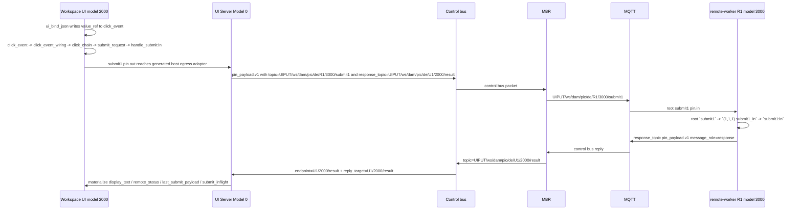
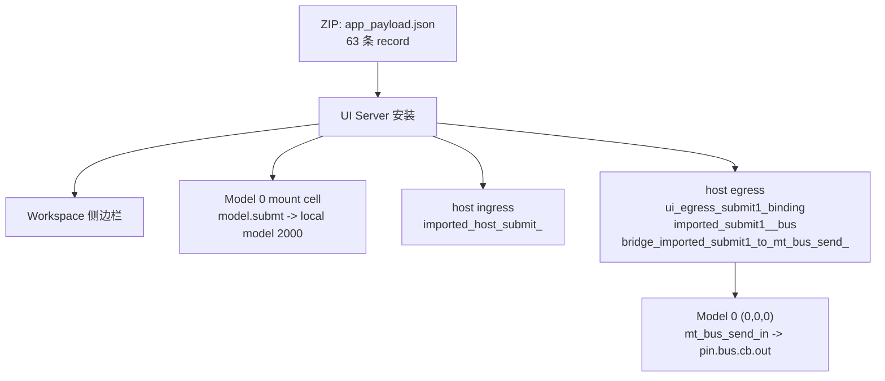

# 最小 Submit 双总线示例 - Visualized

这份文档是 `minimal_submit_app_provider_guide.md` 的可视化补充。它说明 `最小 Submit 双总线示例` 如何从 Workspace UI 进入 Model 0，再经控制总线、MBR、MQTT、remote-worker R1，最后由 R1 把 `message_role=response` 回包发到独立 `response_topic`，并根据 `reply_target_worker_id / reply_target_model_id / reply_target_pin` 回到本地 UI 模型，页面显示 `Submitted: <输入内容>`。

## 总览



## UI App 内部

```mermaid
flowchart LR
  Button["Button Cell labels<br/>ui_component=Button<br/>ui_label=Submit<br/>ui_bind_json.write.pin=click_event"]
  Event["click_event pin.in"]
  Wiring["click_event_wiring pin.connect.label"]
  Click["click_chain pin.out"]
  RootIn["root submit_request pin.in"]
  Handler["handle_submit func.js"]
  SubmitOut["submit1 pin.out"]
  Button --> Event
  Event -->|same cell| Wiring
  Wiring --> Click
  Click -->|root_routes pin.connect.cell| RootIn
  RootIn -->|submit_request_wiring pin.connect.label| Handler
  Handler -->|business records: text, source| SubmitOut
```



Submit 类提交按钮需要 `value_t=modeltable` 与 `value_ref`。`value_ref` 里至少包含 `__mt_payload_kind=ui_event.v1`、`text`、`source`。按钮点击先写 `click_event pin.in`，再由 `click_event_wiring` 转到 `click_chain pin.out`。`handle_submit` 只读取 `text`，不读取旧 `input_value` 或 `message_text` 兜底。

## 安装后自动生成



安装器会生成 `deletable`、`installed_at`、`imported_bundle_model_ids`、`import_root_temp_id`、`host_ingress_generated_model0_labels`、`host_ingress_generated_mount`、`host_ingress_generated_root_labels`、`host_egress_generated_model0_labels`、`host_egress_generated_mount`。这些不是 provider ZIP 内容。

## Endpoint Topic 与 Payload Records

发送给 R1 的 topic 是：

```text
UIPUT/ws/dam/pic/de/R1/3000/submit1
```

请求的 `topic` 描述远端 endpoint；请求还必须携带独立 `response_topic`。回包时，`topic` 与 `response_topic` 都改成本地回包 topic。真正的请求来源、消息方向和回包目标都在 `pin_payload.v1` 的 Temporary ModelTable records 里：

| records | 示例 |
|---|---|
| `message_role` | 请求为 `request`，回包为 `response` |
| `topic` | 请求为 `UIPUT/ws/dam/pic/de/R1/3000/submit1`；回包为 `UIPUT/ws/dam/pic/de/U1/2000/result` |
| `response_topic` | `UIPUT/ws/dam/pic/de/U1/2000/result` |
| `remote_bus_endpoint_v1` -> `endpoint_worker_id` / `endpoint_model_id` / `endpoint_pin` | `R1 / 3000 / submit1` |
| `origin_worker_id` / `origin_model_id` / `origin_pin` | `U1 / 2000 / submit1` |
| `reply_target_worker_id` / `reply_target_model_id` / `reply_target_pin` | `U1 / 2000 / result` |
| nested `payload` | `text`、`source` |

外部客户端模拟回包时，向 `UIPUT/ws/dam/pic/de/U1/2000/result` 发送 `pin_payload.v1`，并把 `message_role` 写成 `response`。手工示例的 `op_id` 可以是 `"manual_result_2000_001"`，嵌套 payload 至少包含：

```json
[
  { "id": 0, "p": 0, "r": 0, "c": 0, "k": "display_text", "t": "str", "v": "Submitted: hello from external client" },
  { "id": 0, "p": 0, "r": 0, "c": 0, "k": "remote_status", "t": "str", "v": "remote_processed" },
  { "id": 0, "p": 0, "r": 0, "c": 0, "k": "last_submit_payload", "t": "json", "v": [] },
  { "id": 0, "p": 0, "r": 0, "c": 0, "k": "submit_inflight", "t": "bool", "v": false }
]
```

## Remote Worker 内部接线

R1 的公开 `submit1` pin 不是程序端点本身。R1 需要用 `submit1_route` 这个 `pin.connect.cell` 把 root `submit1` 接到 `(1,1,1).submit1_in`，再用同 Cell 的 `pin.connect.label` 把 `submit1_in` 接到 `submit1:in`。

```text
root `submit1` -> `(1,1,1).submit1_in` -> `submit1:in`
submit1:out -> `(1,1,1).submit1_out` -> root `result`
```

## 禁止残留

| 项 | 当前要求 |
|---|---|
| `route.reply_to` | 只能作为禁止项出现；ZIP 和 runtime 输入面都不能使用。 |
| `source_model_id` | 不再作为传输 metadata；使用 `origin_model_id` / `reply_target_model_id`。 |
| `worker/R1/model/3000/pin/submit1` | 旧 topic 形态，禁止。 |
| `pin.connect.model` | 已移除；使用 `pin.connect.cell`。 |
| raw `resultPayload` | 公开 result path 必须包装成 `pin_payload.v1`。 |

## 导出

导出文件仍是 Zip，只有 `app_payload.json`。导出接口：

```text
/api/slide-apps/<modelId>/export.zip
```

交互版文档见：[minimal_submit_app_provider_interactive.html](minimal_submit_app_provider_interactive.html)。
