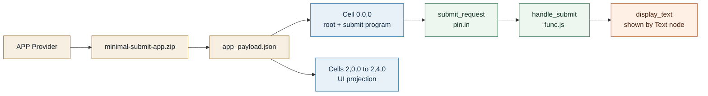
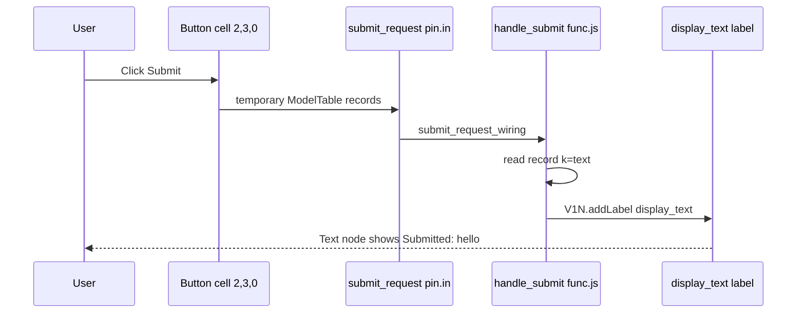
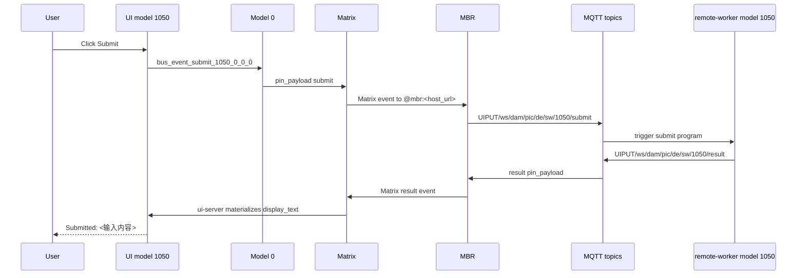
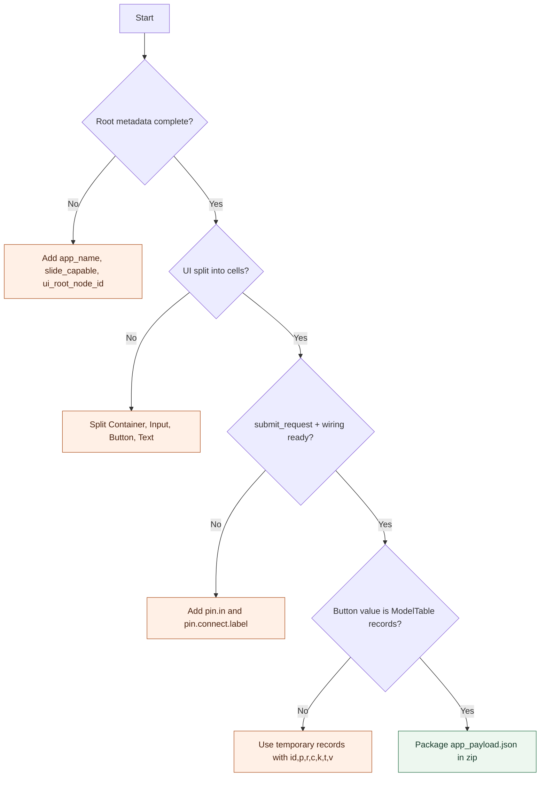

# Minimal Submit App Provider Visualized Guide

这份可视化文档补充 `minimal_submit_app_provider_guide.md`。它只站在滑动 APP 提供方视角解释：你要填哪些 cell、按钮提交什么、submit 程序模型写回什么。

如果你只想快速交付一个最小 APP，记住一句话：

> 页面由 cellwise UI labels 组成；按钮只提交临时 ModelTable records；结果由 `handle_submit` 写回 `display_text`。

项目内可实测的 Workspace 参考模型是 `最小 Submit 双总线示例`，模型 id 为 `1050`。点击按钮后真实路径是：

`UI click -> Model 0 -> Matrix -> MBR -> MQTT -> remote-worker -> MQTT -> MBR -> Matrix -> ui-server -> UI model`

关键连接值如下：

| 项 | 值 |
|---|---|
| Model 0 bus-in key | `bus_event_submit_1050_0_0_0` |
| submit topic | `UIPUT/ws/dam/pic/de/sw/1050/submit` |
| result topic | `UIPUT/ws/dam/pic/de/sw/1050/result` |
| 可见结果 | `Submitted: <输入内容>` |

## 1. 最小交付物长什么样



你交付的是 `app_payload.json`，不是 HTML 页面，也不是一段脚本。宿主导入后会把临时 `id: 0` 换成正式模型 id。

## 2. 单元格地图

| cell | 画面或程序角色 | 你要填的重点 |
|---|---|---|
| `(0,0,0)` | APP root、submit 入口、submit 程序 | `app_name`、`host_ingress_v1`、`input_text`、`display_text`、`submit_request`、`submit_request_wiring`、`handle_submit` |
| `(2,0,0)` | 页面容器 | `ui_component=Container`、`ui_layout=column` |
| `(2,1,0)` | 标题 | `ui_component=Text`、`ui_text=Minimal Submit App` |
| `(2,2,0)` | 输入框 | `ui_component=Input`，读取和草稿写入 `input_text` |
| `(2,3,0)` | Submit 按钮 | `ui_component=Button`，提交 `text` records 到 `submit_request` |
| `(2,4,0)` | 显示 label | `ui_component=Text`，读取 `display_text` |

这个地图是最小结构，不是推荐把所有 APP 都塞进 6 个 cell。复杂页面继续按组件拆更多 cell。

## 3. 按钮到程序模型的路径



上图是提供方 zip 的本地最小闭环。项目内真实参考实现会继续经过 Model 0、Matrix、MBR、MQTT 与 remote-worker：



按钮提交的是下面这种 payload：

```json
[
  { "id": 0, "p": 0, "r": 0, "c": 0, "k": "__mt_payload_kind", "t": "str", "v": "ui_event.v1" },
  { "id": 0, "p": 0, "r": 0, "c": 0, "k": "text", "t": "str", "v": "<用户输入>" }
]
```

`handle_submit` 只读取 `text`，然后写回：

| 写回 label | 类型 | 示例值 |
|---|---|---|
| `display_text` | `str` | `Submitted: hello` |
| `last_submit_payload` | `json` | 原始临时 ModelTable records |

## 4. 哪些东西不用写

| 不要写 | 原因 | 正确做法 |
|---|---|---|
| 安装后的正式 `model_id` | 导入时宿主会自动分配 | `app_payload.json` 使用临时 `id: 0` |
| 宿主 Model 0 路由 | 这是宿主自动生成的 adapter | 只声明 `host_ingress_v1` |
| 整页 HTML 字符串 | UI 不能被按 cell 编辑 | 每个可见组件一个 cell |
| 按钮直接写 `display_text` | 绕过后端程序模型 | 按钮提交，`handle_submit` 写回 |
| `ctx.writeLabel` / `ctx.getLabel` | 旧写法，不作为新文档正例 | 使用 `V1N.addLabel` 写当前 cell label |

## 5. 提供方交付检查



完成后再看完整文字版：`minimal_submit_app_provider_guide.md`。

也可以打开交互版：[minimal_submit_app_provider_interactive.html](minimal_submit_app_provider_interactive.html)。
