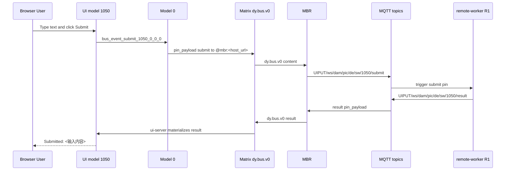
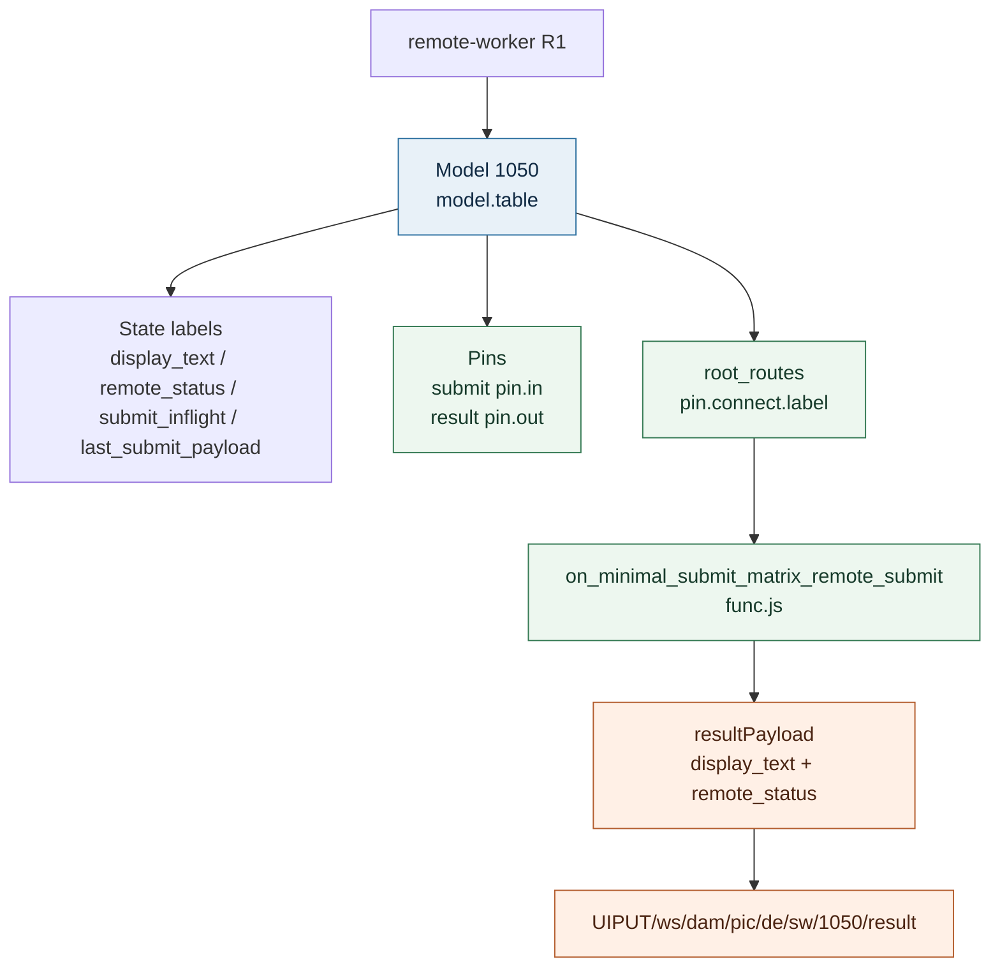
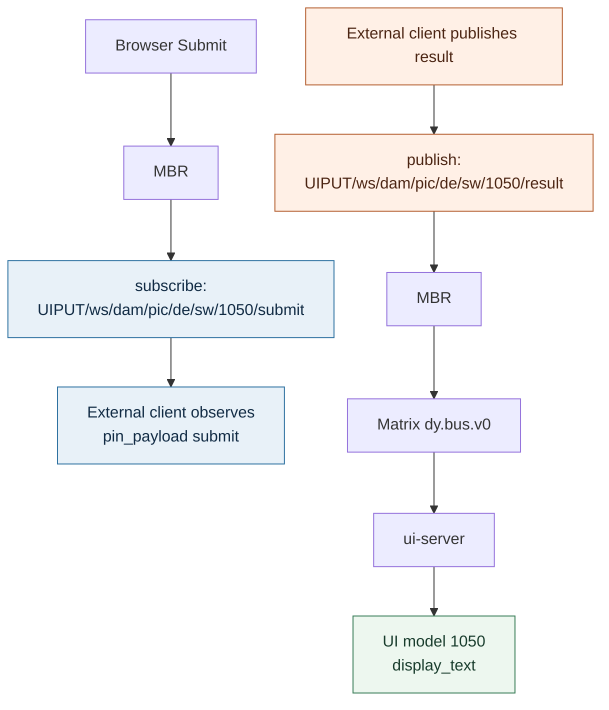

# 最小 Submit 双总线示例可视化说明

这份文档是 `minimal_submit_app_provider_guide.md` 的可视化补充。它说明 `最小 Submit 双总线示例` 如何从 Workspace UI 进入 Model 0，再经过 Matrix、MBR、MQTT、remote-worker R1，最后回到 UI 模型。

## 1. 总链路



## 2. R1 填表结构



R1 的程序只读取 submit payload 里的 `text` record。它不接受 `input_value` 旧字段兜底。

## 3. Workspace 导入过程

```mermaid
flowchart LR
  Zip["minimal-submit-dual-bus.zip"] --> Payload["app_payload.json<br/>temporary id: 0 records"]
  Payload --> Upload["/api/media/upload"]
  Upload --> Mxc["mxc://..."]
  Mxc --> Importer["Workspace: 滑动 APP 导入"]
  Importer --> Materialize["materialize into formal model id"]
  Materialize --> Mount["mount into Workspace"]
  Mount --> Adapter["auto host pins / Model 0 adapter"]
  Adapter --> App["Workspace slide app"]

  classDef file fill:#f7efe1,stroke:#9b6b2f,color:#1f2933;
  classDef host fill:#e8f1f8,stroke:#2b6f9f,color:#102a43;
  classDef app fill:#edf7ef,stroke:#357a54,color:#173b2b;
  class Zip,Payload file;
  class Upload,Mxc,Importer,Materialize,Mount,Adapter host;
  class App app;
```



zip 里只放 `app_payload.json`。这个文件是 ModelTable records array，不是 HTML 页面，也不是 patch ops。UI 应按 cell 拆分：Container、Card、Input、Button、Text、StatusBadge 分别是独立 cell。

开发者可以直接写 `app_payload.json`，也可以先在 Workspace 中填表做出一个 `slide_capable=true` 的 APP，再通过 `Zip` 链接或 `/api/slide-apps/<modelId>/export.zip` 导出。导出包会把正式模型 id 改回临时 id，并移除安装时生成的 `host_*_generated_*` 状态。绑定中的 `model_id` 字段和分散式 `*_model_id` 标签都会随导入/导出一起 remap。

## 4. 外部客户端收发测试



观察 submit 时订阅：

```text
UIPUT/ws/dam/pic/de/sw/1050/submit
```

模拟 R1 回包并改变 UI 时发布：

```text
UIPUT/ws/dam/pic/de/sw/1050/result
```

result 消息的核心 payload：

```json
{
  "version": "v1",
  "type": "pin_payload",
  "source_model_id": 1050,
  "pin": "result",
  "payload": [
    { "id": 0, "p": 0, "r": 0, "c": 0, "k": "display_text", "t": "str", "v": "Submitted: hello from external client" },
    { "id": 0, "p": 0, "r": 0, "c": 0, "k": "remote_status", "t": "str", "v": "remote_processed" },
    { "id": 0, "p": 0, "r": 0, "c": 0, "k": "submit_inflight", "t": "bool", "v": false }
  ]
}
```

## 5. 快速检查表

| 检查项 | 正确结果 |
|---|---|
| UI 入口 | `bus_event_submit_1050_0_0_0` |
| Matrix event | `dy.bus.v0`，目标 `@mbr:<host_url>` |
| submit topic | `UIPUT/ws/dam/pic/de/sw/1050/submit` |
| result topic | `UIPUT/ws/dam/pic/de/sw/1050/result` |
| R1 程序 | `on_minimal_submit_matrix_remote_submit` 只读 `text` |
| 页面结果 | `Submitted: <输入内容>` |
| 禁止残留 | 无 `pin.connect.model`，无 `ctx.writeLabel/getLabel/rmLabel`，无 `input_value` 兼容兜底 |

交互版文档见：[minimal_submit_app_provider_interactive.html](minimal_submit_app_provider_interactive.html)。
