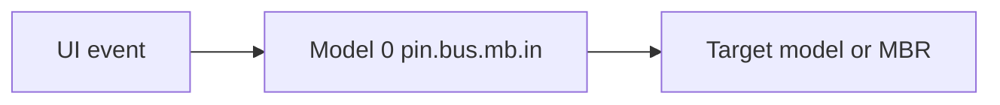

# UI Model Authoring Guide (cellwise.ui.v1)

This guide explains how to build Workspace / slide app interfaces by filling ModelTable labels.

The current authoring contract is `cellwise.ui.v1`: every visible component is a cell, and labels on that cell describe its component type, placement, text, data binding, and event intent. Do not store a full page as an HTML string or as one large JSON object.

Current-model references inside UI labels omit `model_id`. For example, if a component reads `0,0,0 / result_text` from the same slide app model, write `{ "p": 0, "r": 0, "c": 0, "k": "result_text" }`. Only cross-model references should include `model_id`, such as system overlay model `-2`, runtime model `-1`, or a deliberately referenced positive model.

## Quick Start

Create a minimal page with a root container and one title.

| cell | k | t | v |
|---|---|---|---|
| `0,0,0` | `app_name` | `str` | `Hello UI` |
| `0,0,0` | `slide_capable` | `bool` | `true` |
| `0,0,0` | `slide_surface_type` | `str` | `workspace.page` |
| `0,0,0` | `ui_authoring_version` | `str` | `cellwise.ui.v1` |
| `0,0,0` | `ui_root_node_id` | `str` | `hello_root` |
| `2,0,0` | `ui_node_id` | `str` | `hello_root` |
| `2,0,0` | `ui_component` | `str` | `Container` |
| `2,0,0` | `ui_layout` | `str` | `column` |
| `2,0,0` | `ui_gap` | `int` | `12` |
| `2,1,0` | `ui_node_id` | `str` | `hello_title` |
| `2,1,0` | `ui_component` | `str` | `Text` |
| `2,1,0` | `ui_parent` | `str` | `hello_root` |
| `2,1,0` | `ui_order` | `int` | `10` |
| `2,1,0` | `ui_text` | `str` | `Hello UI` |

If you change `2,1,0 / ui_text`, the visible title changes. If you change `0,0,0 / app_name`, the Workspace list label changes.

## Essentials

### Model-Level Labels

These labels usually live on `0,0,0`.

| label | t | required | purpose |
|---|---|---|---|
| `app_name` | `str` | for Workspace apps | Name shown in the Workspace app list. |
| `slide_capable` | `bool` | for slide apps | Marks the model as runnable from Workspace and the Web tablet desktop. |
| `slide_app_summary` | `str` | for OS shell apps | Short description shown by the OS shell before opening the app. Required for positive `slide_capable` Workspace apps. |
| `slide_surface_type` | `str` | recommended | Describes the host surface, for example `workspace.page` or `flow.shell`. |
| `ui_authoring_version` | `str` | yes | Must be `cellwise.ui.v1`. |
| `ui_root_node_id` | `str` | yes | Points to an existing `ui_node_id`. |

### Node-Level Labels

Each visible component is one UI node cell.

| label | t | required | purpose |
|---|---|---|---|
| `ui_node_id` | `str` | yes | Stable component identity. |
| `ui_component` | `str` | yes | Component type, such as `Container`, `Text`, `Button`, `Markdown`. |
| `ui_parent` | `str` | except root | Parent node id for visual containment. |
| `ui_order` | `int` | recommended | Sibling order under the same parent. |
| `ui_slot` | `str` | optional | Named region, when a component supports slots. |

Use stable node ids such as `submit_button`, not coordinates such as `2_4_0`. Coordinates can change during refactoring; node ids should not.

### Containment And Layout

Visual nesting uses UI nodes, not submodels.

| need | use |
|---|---|
| Put three buttons in one row | `Container` with `ui_layout=row`; each button uses `ui_parent` pointing to that container. |
| Add another row | Add another `Container` cell with a later `ui_order`. |
| Put a column inside a row | Add a child `Container` with `ui_layout=column`. |
| Mount an independent child model | Use `model.submt`; do not use it for ordinary visual rows. |

Example: a row with three buttons.

| cell | k | t | v |
|---|---|---|---|
| `2,2,0` | `ui_node_id` | `str` | `actions_row` |
| `2,2,0` | `ui_component` | `str` | `Container` |
| `2,2,0` | `ui_parent` | `str` | `root` |
| `2,2,0` | `ui_order` | `int` | `20` |
| `2,2,0` | `ui_layout` | `str` | `row` |
| `2,2,0` | `ui_gap` | `int` | `8` |
| `2,2,1` | `ui_node_id` | `str` | `save_button` |
| `2,2,1` | `ui_component` | `str` | `Button` |
| `2,2,1` | `ui_parent` | `str` | `actions_row` |
| `2,2,1` | `ui_order` | `int` | `10` |
| `2,2,1` | `ui_label` | `str` | `Save` |

To add a new button, add one more cell with `ui_parent=actions_row` and a later `ui_order`.

## Component Reference

### Layout

#### Container

`Container` is the default composition component.

| label | t | example |
|---|---|---|
| `ui_layout` | `str` | `row`, `column` |
| `ui_gap` | `int` | `12` |
| `ui_wrap` | `bool` | `true` |
| `ui_style_align_items` | `str` | `center` |
| `ui_style_justify_content` | `str` | `space-between` |

#### Card, Form, FormItem

Use `Card` for panels, `Form` for grouped input, and `FormItem` for labeled fields.

| component | common labels |
|---|---|
| `Card` | `ui_title`, `ui_style_width`, `ui_style_flex` |
| `Form` | `ui_parent`, `ui_order` |
| `FormItem` | `ui_label` |

#### OS Shell Components

The Android tablet shell uses the same cellwise model contract. These components are reusable visual primitives built from basic HTML/CSS in the renderer.

| component | purpose |
|---|---|
| `StatusBar` | Top system status surface. Common props: `title`, `subtitle`, `status`, `time`. |
| `DesktopGrid` | Responsive app-card grid. Common prop: `minColumnWidth`. |
| `AppCard` | Launchable app card. Common props: `title`, `summary`, `mark`, `accent`, `appOrigin`, `sourceDE`; can use the same `ui_bind_json.write` as a `Button`. |
| `WidgetPanel` | Desktop widget/card region. |
| `Taskbar` | Bottom dock/taskbar surface. |
| `AppWindow` | Foreground app frame. |
| `SplitPaneWindow` | Foreground split-pane frame. |
| `AppSwitcher` | Recent task grid. |
| `Drawer` | Hidden side panel for secondary information. Common props: `title`, `placement`, `size`; bind `modelValue` through `ui_bind_json`. |
| `Dialog` | Modal panel for confirmation, details, or form flows. Common props: `title`, `width`; bind `modelValue` through `ui_bind_json`. |
| `HostSlot` | Internal host insertion point used by UI Server built-in shell frames; ordinary slide app authors should not use it. |

For app cards, do not duplicate app descriptions in frontend code. Store the short text in the app model root as `slide_app_summary`, then let `ws_apps_registry` project it into the desktop card.

Current desktop shell contract:

- The desktop shell itself is a cellwise UI model (`desktop_catalog_ui.json`).
- The root shell fills the browser viewport and prevents outer page scrolling.
- The desktop no longer uses a visible `NavigationRail`, desktop `QuickSettingsPanel`, or always-visible split pane.
- The Dock contains only `Home`, `Tasks`, and `MB`; `MB` opens Matrix Suite until the dedicated management-bus app is completed.
- Built-in apps and slid-in apps are shown in separate grids. Slid-in cards must visibly show their source DE, or `source unknown` if the source is missing.

### Display

#### Text

| label | purpose |
|---|---|
| `ui_text` | Static text. |
| `ui_variant` | Element text type, such as `info`, `success`, `danger`. |
| `ui_bind_read_json` | Dynamic text from a label. |
| `ui_style_font_size`, `ui_style_font_weight`, `ui_style_color` | Common text styling. |

#### Markdown

Use `Markdown` for documentation-style content. It supports headings, paragraphs, lists, tables, inline code, fenced code blocks, and fenced `mermaid` source-preview blocks.

| label | purpose |
|---|---|
| `ui_markdown` | Inline Markdown text. |
| `ui_bind_read_json` | Read Markdown from a label. |
| `ui_style_max_width` | Keep long docs readable. |

Example:

```json
{
  "model_id": 1037,
  "p": 2,
  "r": 4,
  "c": 0,
  "k": "ui_markdown",
  "t": "str",
  "v": "## Events\\n\\n```json\\n{ \\"pin\\": \\"click\\" }\\n```"
}
```

Use one Markdown node per logical section. Do not put an entire app manual into a single cell if sections, examples, and diagram source previews should be reusable.

#### CodeBlock And MermaidDiagram

Use `CodeBlock` for raw code values from a label. Use `MermaidDiagram` when the diagram is already a dedicated component. Use a Markdown fenced `mermaid` block when the diagram source belongs inside a document section.

### Inputs

#### Input

| label | purpose |
|---|---|
| `ui_label` | Field label when wrapped by `FormItem`. |
| `ui_placeholder` | Placeholder text. |
| `ui_bind_json.read` | Current field value. |
| `ui_bind_json.write` | Draft or commit target. |
| `ui_variant` | Input type, such as `textarea` or `password`. |

#### Select, RadioGroup, NumberInput

| component | key labels |
|---|---|
| `Select` | `ui_options_json`, `ui_bind_json` |
| `RadioGroup` | `ui_options_json`, `ui_bind_json` |
| `NumberInput` | `ui_bind_json`, small extra numeric props can stay in `ui_props_json` until promoted. |

### Actions

#### Button

| label | purpose |
|---|---|
| `ui_label` | Button text. |
| `ui_variant` | Element button type, such as `primary`, `danger`. |
| `ui_bind_json.write` | The action or pin to trigger. |

Buttons should not directly mutate final business truth. Formal business should enter the current pin chain, and the program model should write the result back to ModelTable.

Example: trigger a pin with ModelTable payload records.

```json
{
  "write": {
    "pin": "click",
    "value_t": "modeltable",
    "value_ref": [
      { "id": 0, "p": 0, "r": 0, "c": 0, "k": "__mt_payload_kind", "t": "str", "v": "ui_event.v1" },
      { "id": 0, "p": 0, "r": 0, "c": 0, "k": "input_text", "t": "str", "v": { "$label": { "model_id": -2, "p": 0, "r": 0, "c": 0, "k": "draft_text" } } }
    ],
    "commit_policy": "immediate"
  }
}
```

For same-workspace bus events, the formal path is:

```text
UI event -> bus_event_v2 -> Model 0 pin.bus.cb.in -> pin route -> target model / MBR
```

Explicit management semantics use `pin.bus.mb.in` / `pin.bus.mb.out`; they are not the default UI path.

### Data Display

| component | use |
|---|---|
| `Table` + `TableColumn` | Lists and registries. Use `ui_data_ref` or `ui_props_json.data` with a label ref. |
| `Tree` | Hierarchical data, such as docs or assets. |
| `StatusBadge` | Compact status display. |
| `StatCard` | Metrics. |
| `Terminal` | Logs and traces. |
| `ColorBox` | Color preview bound to a color label. |

### Task Components

`To Do Board` uses two registered task-specific renderer extensions. They are still authored through `cellwise.ui.v1` labels, but they are not basic layout components. Use them when a page needs a reusable task-board interaction instead of manually composing every card and drop target with ordinary `Container` nodes.

| component | purpose | common labels |
|---|---|---|
| `TodoBoard` | Multi-column task board. It renders one column per status, task cards, edit buttons, status buttons, and drag/drop status changes. | `ui_props_json.tasksRef`, `ui_props_json.columns`, `ui_props_json.emptyText`, `ui_bind_json.write` |
| `TodoFocusList` | Focus view for unfinished tasks. It hides `done` / `archived` tasks and can filter by text. | `ui_props_json.tasksRef`, `ui_props_json.filterRef`, `ui_props_json.columns`, `ui_props_json.emptyText`, `ui_bind_json.write` |

Both components read task records from a label such as `tasks_json`. A task record should have at least:

| field | meaning |
|---|---|
| `id` | Stable task id. |
| `title` | Task title shown on cards and focus rows. |
| `body` | Longer task text. |
| `status` | Status value, for example `todo`, `doing`, `done`, or `archived`. |

`columns` is an array in `ui_props_json`. Each item controls one board column and status badge.

```json
[
  { "value": "todo", "label": "还未开始", "tone": "#2563eb", "bg": "#eff6ff" },
  { "value": "doing", "label": "正在进行", "tone": "#d97706", "bg": "#fffbeb" },
  { "value": "done", "label": "已完成", "tone": "#16a34a", "bg": "#f0fdf4" },
  { "value": "archived", "label": "已归档", "tone": "#64748b", "bg": "#f8fafc" }
]
```

`TodoBoard` example node:

```json
[
  { "op": "add_label", "model_id": 1086, "p": 2, "r": 11, "c": 0, "k": "ui_node_id", "t": "str", "v": "todo_board" },
  { "op": "add_label", "model_id": 1086, "p": 2, "r": 11, "c": 0, "k": "ui_component", "t": "str", "v": "TodoBoard" },
  { "op": "add_label", "model_id": 1086, "p": 2, "r": 11, "c": 0, "k": "ui_parent", "t": "str", "v": "todo_board_tab" },
  { "op": "add_label", "model_id": 1086, "p": 2, "r": 11, "c": 0, "k": "ui_props_json", "t": "json", "v": {
    "tasksRef": { "p": 0, "r": 0, "c": 0, "k": "tasks_json" },
    "columns": [
      { "value": "todo", "label": "还未开始", "tone": "#2563eb", "bg": "#eff6ff" },
      { "value": "doing", "label": "正在进行", "tone": "#d97706", "bg": "#fffbeb" },
      { "value": "done", "label": "已完成", "tone": "#16a34a", "bg": "#f0fdf4" },
      { "value": "archived", "label": "已归档", "tone": "#64748b", "bg": "#f8fafc" }
    ],
    "emptyText": "把任务拖到这里"
  } },
  { "op": "add_label", "model_id": 1086, "p": 2, "r": 11, "c": 0, "k": "ui_bind_json", "t": "json", "v": {
    "write": { "bus_event_v2": true, "bus_in_key": "todo_1086_bus_event", "commit_policy": "immediate" }
  } }
]
```

The example above is the built-in Model 1086 form, where Model 0 already declares `todo_1086_bus_event`. For a ZIP provider payload, use temporary records without `op` / `model_id`, declare root `host_ingress_v1`, and set the component write key to:

```json
{ "write": { "bus_event_v2": true, "bus_in_key": "bus_event_submit_0_0_0_0", "commit_policy": "immediate" } }
```

During installation, UI Server rewrites `bus_event_submit_0_0_0_0` to `imported_host_submit_<actualModelId>`. Do not hard-code `1086`, `4100`, or `model_id: 0` in a provider ZIP.

The component generates temporary ModelTable event payloads automatically. It never writes final task truth directly. For example:

| user action | emitted `todo_action` | extra records |
|---|---|---|
| Click card edit | `open_edit` | `task_id` |
| Click start / finish / archive | `move_status` | `task_id`, `status` |
| Drag a card to another column | `move_status` | `task_id`, `status` |

`TodoFocusList` uses the same write target and emits `open_edit` / `move_status`. It additionally reads `filterRef` to hide tasks whose title/body do not match the current filter text.

## Binding Patterns

### Read Binding

Use `ui_bind_read_json` when a component only reads from a label in the same model.

```json
{ "p": 0, "r": 0, "c": 0, "k": "bg_color" }
```

This same rule applies to `ui_bind_json.read`, `ui_bind_json.write.target_ref`, `$label`, `tasksRef`, and `filterRef`: when the target label is in the current model, omit `model_id`. The deployment model id is assigned by UI Server during installation.

For a deliberate cross-model read, keep `model_id` explicit:

```json
{ "model_id": 100, "p": 0, "r": 0, "c": 0, "k": "bg_color" }
```

Prefer `ui_bind_read_json` for new apps. Split read labels exist only for older fill-table surfaces that cannot write JSON conveniently:

| label | v |
|---|---|
| `ui_read_model_id` | `100` |
| `ui_read_p` | `0` |
| `ui_read_r` | `0` |
| `ui_read_c` | `0` |
| `ui_read_k` | `bg_color` |

### Draft Writes

UI drafts can use `label_update` or `ui_owner_label_update` through the renderer mailbox.

```json
{
  "read": { "p": 0, "r": 0, "c": 0, "k": "applicant" },
  "write": {
    "action": "ui_owner_label_update",
    "mode": "intent",
    "target_ref": { "p": 0, "r": 0, "c": 0, "k": "applicant" },
    "commit_policy": "on_blur"
  }
}
```

### Formal Business Events

Use pin write binding with a ModelTable payload. The payload must be an array of temporary records using `id`, `p`, `r`, `c`, `k`, `t`, and `v`. Do not send loose top-level business keys.

## Full Example: Form Page

This is the structure used by simple request forms such as Leave Request and Repair Request.

| node | component | parent | role |
|---|---|---|---|
| `leave_root` | `Container` | - | Page root. |
| `leave_title` | `Text` | `leave_root` | Page title. |
| `leave_form` | `Form` | `leave_root` | Field group. |
| `leave_applicant_item` | `FormItem` | `leave_form` | Field label. |
| `leave_applicant_input` | `Input` | `leave_applicant_item` | Field editor. |
| `leave_type_item` | `FormItem` | `leave_form` | Select label. |
| `leave_type_select` | `Select` | `leave_type_item` | Select editor. |

Each field has its own cell. Labels, placeholders, options, and bindings are not hidden inside one big blob.

## Full Example: Documentation Page

A documentation page should be split into sections.

| node | component | purpose |
|---|---|---|
| `guide_root` | `Container` | Page root. |
| `guide_hero` | `Section` | Title and short introduction. |
| `guide_quick_start` | `Markdown` | Quick start prose and table. |
| `guide_api_reference` | `Markdown` | Component API reference. |
| `guide_event_flow` | `Markdown` | Contains a fenced `mermaid` source preview. |
| `guide_payload_example` | `CodeBlock` or `Markdown` fenced code | Highlighted code example. |

Example Markdown value:

````markdown
## Event Flow



```json
{ "pin": "click", "value_t": "modeltable" }
```
````

## Validation Checklist

Run the compliance audit before shipping a UI model.

| check | pass condition |
|---|---|
| Discoverable | Workspace apps have `app_name`; positive slide apps have `slide_capable=true`, `slide_surface_type`, and non-empty `slide_app_summary` so they can appear in Workspace and on the OS shell desktop. |
| Cellwise | `ui_authoring_version=cellwise.ui.v1`. |
| Root valid | `ui_root_node_id` points to an existing `ui_node_id`. |
| Granular | Each visible component is a cell. |
| Containment clear | Every non-root node has `ui_parent`. |
| Stable order | Siblings have `ui_order`. |
| No whole-page blob | No active `page_asset_v0`, no raw `Html`, no schema fallback as primary UI. |
| Events auditable | Business events go through pin / Model 0 bus paths. |
| Payload valid | Pin payloads are temporary ModelTable record arrays. |
| Browser verified | Page loads, edits change labels, buttons route as expected. |

Current deterministic check:

```bash
node scripts/tests/test_0346_ui_model_compliance_contract.mjs
```

## Anti-Patterns

| anti-pattern | why it is wrong | use instead |
|---|---|---|
| One `Html` component for a whole page | The UI is no longer fill-table editable. | `Container`, `Section`, `Text`, `Markdown`, and child nodes. |
| A huge `ui_props_json` with text/layout/labels | Users cannot edit the UI by obvious labels. | `ui_text`, `ui_label`, `ui_layout`, `ui_gap`, `ui_options_json`. |
| Missing `ui_parent` | Components can float to the wrong place. | Explicit parent node ids. |
| Using `model.submt` for rows | It creates a model boundary where only visual layout is needed. | Nested `Container` nodes. |
| Button writes final business truth directly | It bypasses the runtime chain. | Trigger a pin and let the program model write results. |
| Loose JSON payload on pins | MBR/worker contracts cannot validate it consistently. | Temporary ModelTable record arrays. |

## When To Add A Component

Add a new renderer component only when labels cannot express a reusable UI capability.

| need | decision |
|---|---|
| Change text, labels, order, or layout | Fill labels; do not add code. |
| Add a stable prop used by many pages | Promote it from `ui_props_json` to a named label. |
| Render a reusable visual pattern | Add a component to the registry and renderer. |
| Add a new business operation | Define the ModelTable payload and pin route first. |
| Compose a child app | Use `model.submt` only for an independent child model. |

The goal is not to eliminate code. The goal is to make user-authored UI pages editable by cells first, with renderer code serving as the component library.
