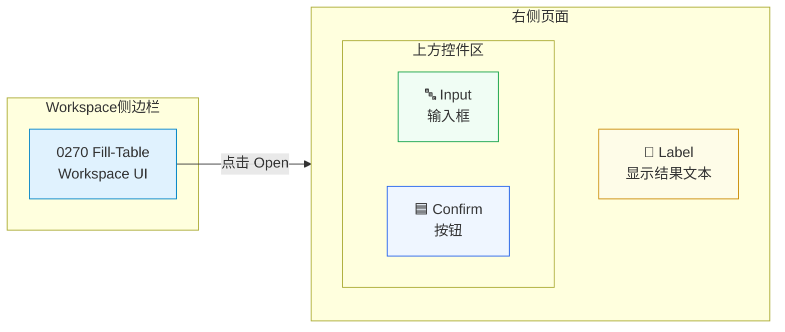
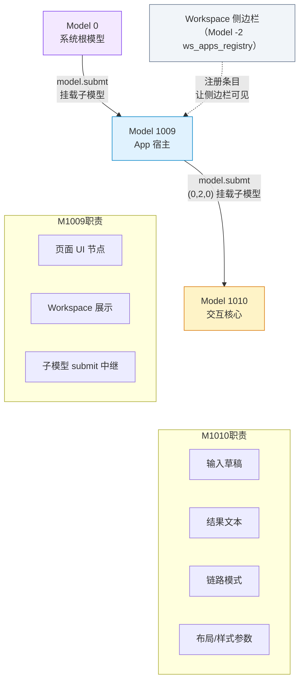
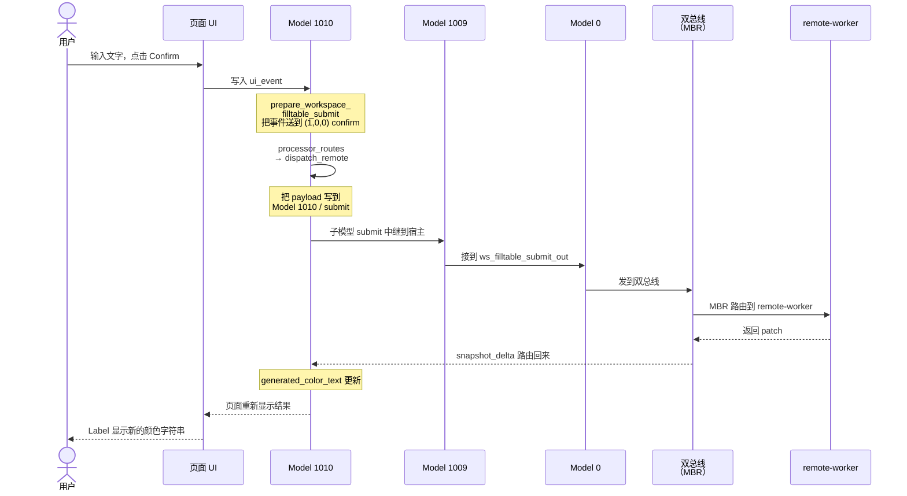
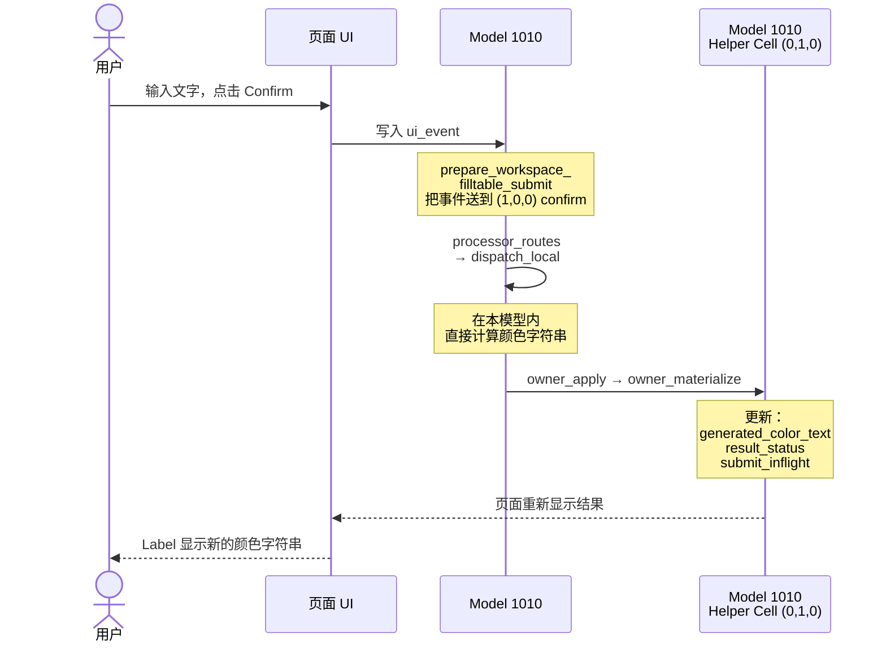
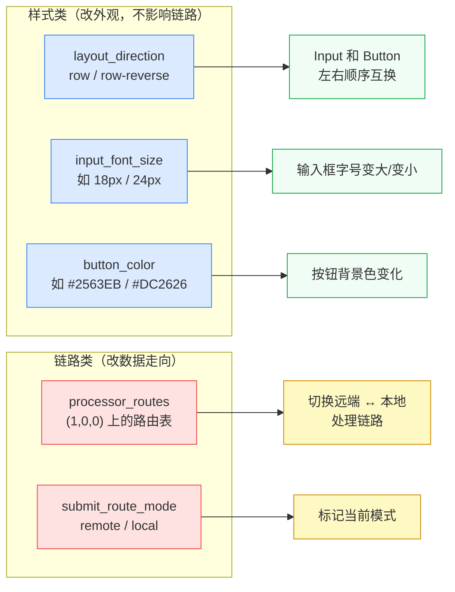
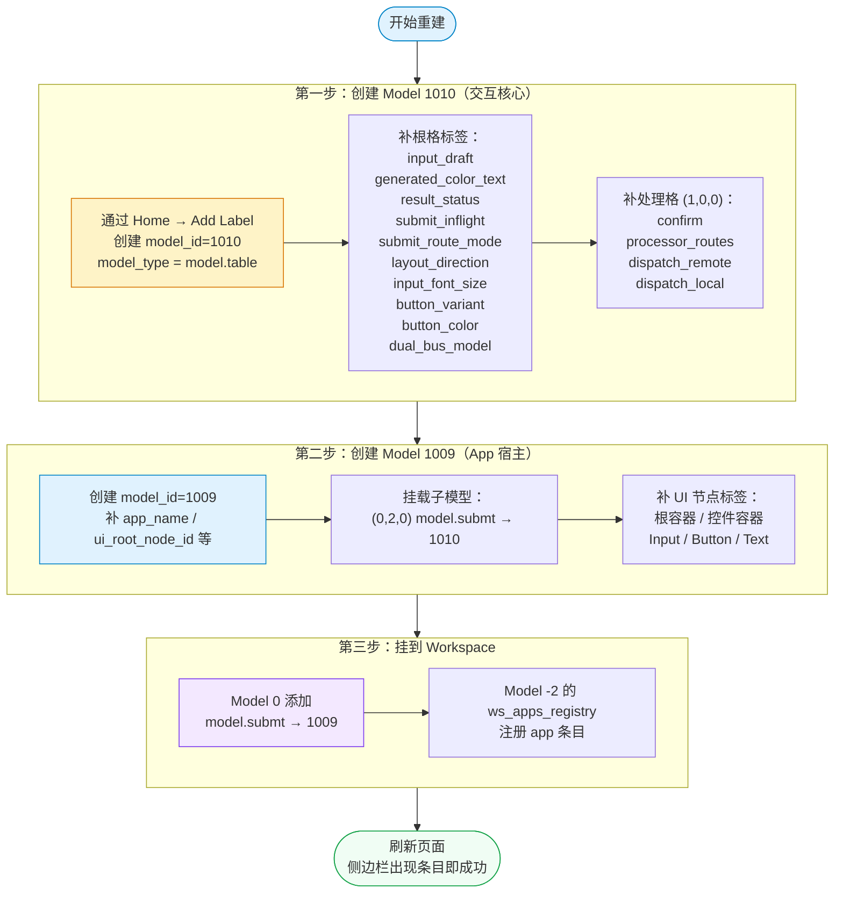

# Workspace UI 填表示例 — 可视化指南

本文用图解方式说明 `0270 Fill-Table Workspace UI` 这个示例是怎么工作的。
你不需要读过原始技术文档，看完本文就能理解全貌。

---

## 一、总览：最终你会看到什么界面



**怎么看这张图：** 打开 Workspace 后，左边侧边栏有一个叫 `0270 Fill-Table Workspace UI` 的条目。点击 `Open`，右侧会出现一个输入框、一个确认按钮、和一行结果文本。你在输入框里打字，点 Confirm，下方 Label 就会显示返回的颜色字符串。

---

## 二、模型关系：谁负责什么

本示例由 3 个模型协作：



**怎么看这张图：**

- **Model 0** 是系统的根，所有模型最终挂在它下面。
- **Model 1009** 是这个小应用的"壳"，负责页面长什么样、在 Workspace 里怎么显示。
- **Model 1010** 是真正干活的，存着你输入的文字、返回的结果、以及所有样式和路由配置。
- Workspace 侧边栏通过 Model -2 的 `ws_apps_registry` 知道有这个条目。

---

## 三、远端模式链路（默认）

> **默认状态就是远端模式。** 不需要做任何修改。

点击 Confirm 后，数据按下面路径走一圈：



**怎么看这张图：** 从左到右是"请求发出去"，从右到左是"结果回来"。数据先从页面进入 Model 1010，往上经过 Model 1009 → Model 0 → 双总线 → remote-worker；remote-worker 处理完后，结果原路返回，最终更新页面上的 Label。

关键配置（决定走远端的标签）：

- `Model 1010 / submit_route_mode = remote`
- `Model 1010 / (1,0,0) / processor_routes` 中 confirm 接到 `dispatch_remote`

---

## 四、本地模式链路（改表切换）

> **通过改一个标签就能从远端切到本地。** 不需要改页面结构。

把 `Model 1010 / (1,0,0) / processor_routes` 改成：

```json
[
  {
    "from": "(self, confirm)",
    "to": ["(func, dispatch_local:in)"]
  }
]
```

改完后点击 Confirm，数据走的是更短的路径：



**怎么看这张图：** 和远端模式相比，数据不再离开 Model 1010。计算在本地完成，结果通过 Helper Cell 落表后直接反映到页面。整个过程不经过 Model 1009、Model 0、也不走双总线。

---

## 五、改表影响：哪些标签控制什么



**怎么看这张图：** 左边蓝色是"改了只影响外观"的标签，红色是"改了会影响数据走向"的标签。右边绿色是外观效果，黄色是链路效果。所有标签都在 Model 1010 上。

具体操作对照：

| 操作 | 标签位置 | 改什么 | 看到什么变化 |
|------|---------|--------|------------|
| 改 `layout_direction` 为 `row-reverse` | Model 1010 (0,0,0) | 布局方向 | Input 和 Button 左右互换 |
| 改 `input_font_size` 为 `24px` | Model 1010 (0,0,0) | 字号 | 输入框文字变大 |
| 改 `button_color` 为 `#DC2626` | Model 1010 (0,0,0) | 颜色值 | 按钮变红 |
| 改 `processor_routes` 接到 `dispatch_local` | Model 1010 (1,0,0) | 路由目标 | Confirm 走本地处理 |

---

## 六、重建流程：从零做出这个案例



**怎么看这张图：** 从上往下按顺序做。先建交互核心（Model 1010），再建应用壳（Model 1009），最后挂到 Workspace 让它在侧边栏可见。每一步都是通过 Home 页面的 Add Label 来填表完成的。

---

## 七、用户最短操作路径

### 使用现成示例（5 步）

1. 打开 **Workspace**
2. 在侧边栏找到 **0270 Fill-Table Workspace UI**
3. 点击 **Open**，右侧出现 Input + Button + Label
4. 输入任意文字，点击 **Confirm**，等 Label 显示颜色字符串
5. 完成 — 你已经跑通了远端模式的完整链路

### 切换到本地模式（在上面基础上 +2 步）

6. 进 Home，找到 `Model 1010 / (1,0,0) / processor_routes`，把 `dispatch_remote` 改成 `dispatch_local`
7. 回到页面点 **Confirm**，Label 仍然显示结果，但数据不再走远端

### 改样式试试（任选一个）

- 改 `layout_direction` 为 `row-reverse` → Input 和 Button 左右互换
- 改 `input_font_size` 为 `24px` → 输入框字号变大
- 改 `button_color` 为 `#DC2626` → 按钮变红

---

## 八、一图总结两种模式对比

```mermaid
graph TD
    subgraph 远端模式default["远端模式 ✅ 默认"]
        r1["UI → Model 1010"] --> r2["→ Model 1009"]
        r2 --> r3["→ Model 0"]
        r3 --> r4["→ 双总线 MBR"]
        r4 --> r5["→ remote-worker"]
        r5 --> r6["结果原路返回"]
    end

    subgraph 本地模式switch["本地模式（改表切换）"]
        l1["UI → Model 1010"] --> l2["→ dispatch_local\n本地计算"]
        l2 --> l3["→ Helper Cell\n落表更新"]
    end

    切换方法["改 processor_routes：\ndispatch_remote → dispatch_local"]

    远端模式default -.-> 切换方法
    切换方法 -.-> 本地模式switch

    style 远端模式default fill:#eff6ff,stroke:#2563eb
    style 本地模式switch fill:#f0fdf4,stroke:#16a34a
    style 切换方法 fill:#fef3c7,stroke:#d97706
```

**怎么看这张图：** 左边是默认的远端模式，数据要走 5 个节点才到 remote-worker。右边是本地模式，数据在 Model 1010 内部就处理完了。中间黄色方块是切换方法 — 只需要改一个标签。

---

## 九、补充说明：原文未展开的细节

以下信息来自代码和系统模型定义文件，已查实。

### 9.1 `submit_route_mode` 与 `processor_routes` 的关系

**结论：切换模式只需要改 `processor_routes`，不需要手动改 `submit_route_mode`。**

`submit_route_mode` 是一个描述性标签，不参与路由决策。真正决定数据走远端还是本地的是 `processor_routes`。

当 `dispatch_remote` 或 `dispatch_local` 函数执行时，会自动回写 `submit_route_mode` 的值（分别写 `"remote"` 或 `"local"`）。这个标签始终反映最近一次实际走的链路，不需要手动维护。

### 9.2 `dual_bus_model` 标签的具体内容

这是一个 JSON 对象标签（`t = "json"`），存在 Model 1010 的根格 (0,0,0)，定义了双总线事件桥接的三个关键函数名：

```json
{
  "ui_event_func": "prepare_workspace_filltable_submit",
  "model0_egress_label": "ws_filltable_submit_out",
  "model0_egress_func": "forward_workspace_filltable_submit_from_model0"
}
```

| 字段 | 作用 |
|------|------|
| `ui_event_func` | UI 事件处理函数名 — 接收 `ui_event` 并把事件送到处理链 |
| `model0_egress_label` | Model 0 上的出口标签名 — 远端模式下事件通过它发到双总线 |
| `model0_egress_func` | Model 0 上的转发函数名 — 把事件从 Model 0 转发到双总线 |

这个标签是受保护标签（protected_label_key），不能通过填表策略修改。普通用户不需要动它。

### 9.3 Helper Cell `(0,1,0)` 的工作方式

Helper Cell (p=0, r=1, c=0) **没有预置标签**。它是一个动态接收器：`dispatch_local` 函数在运行时向它写入 `owner_apply` 标签（pin.in 类型），内容是一组变更记录（records）。

写入格式示例：

```json
{
  "op": "apply_records",
  "target_model_id": 1010,
  "records": [
    { "k": "generated_color_text", "t": "str", "v": "..." },
    { "k": "result_status", "t": "str", "v": "ok" },
    { "k": "submit_inflight", "t": "bool", "v": false }
  ]
}
```

服务端收到 `owner_apply` 后执行 `owner_materialize`，把变更记录真正写入 Model 1010 的根格。用户不需要在这个 Cell 上预先放任何标签。

### 9.4 `button_variant` 的取值范围

`button_variant` 是字符串类型标签，默认值为 `"primary"`。它映射到 Element Plus 的 ElButton 组件的 `type` 属性，同时支持几个额外的变体：

| 值 | 效果 |
|----|------|
| `primary` | 默认蓝色按钮（Element Plus 主题色） |
| `pill` | 胶囊按钮 — 圆角 9999px，左右内边距 24px |
| `text` | 纯文字按钮 — 无背景无边框 |
| `link` | 链接样式按钮 — 看起来像超链接 |
| 其他 Element Plus 值 | 如 `success`、`warning`、`danger`、`info` |
