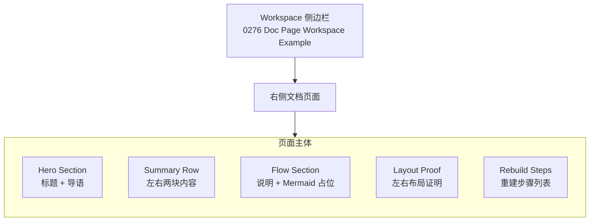
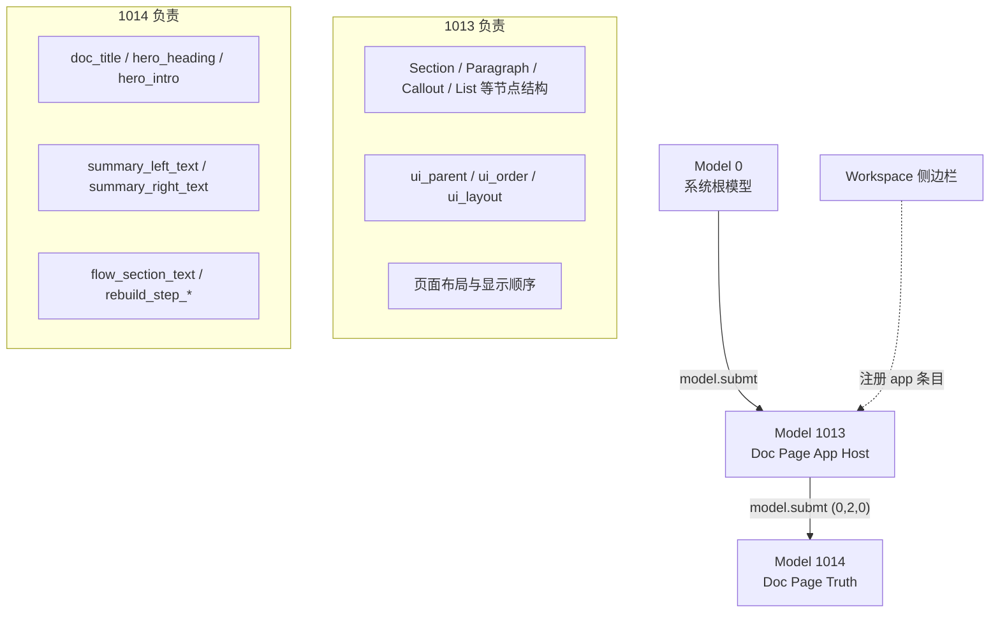
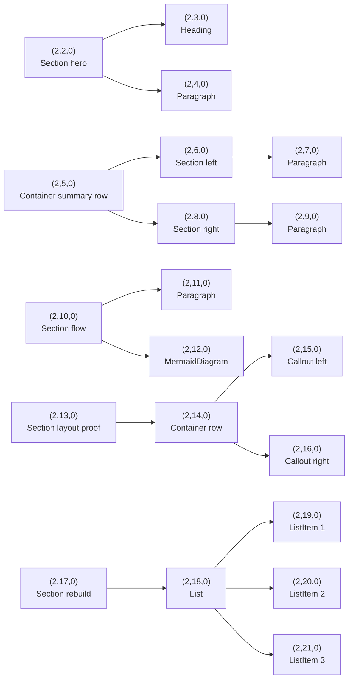
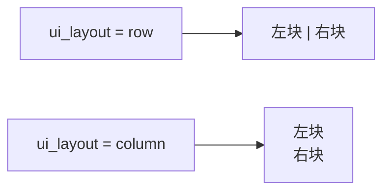
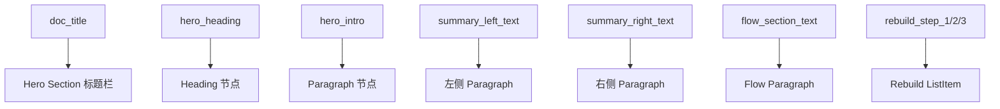
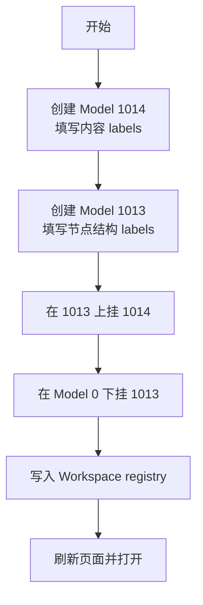

# Workspace 文档页面填表示例 — 可视化指南

本文不再解释旧的 `0270 Fill-Table Workspace UI` 三组件例子。  
它现在用图解方式说明新的正式示例：

- `0276 Doc Page Workspace Example`

目标是展示一件事：

- 一个接近文档页面的界面，也可以通过填表组成
- 结构、内容、布局位置，都可以由模型表里的 label 决定

---

## 一、总览：最终看到的页面



**怎么看这张图：** 这个页面是一个正式的 Workspace 条目。打开后，右侧不是表单，而是一个“像文档一样”的页面，分成多个 section。

---

## 二、模型关系：谁负责结构，谁负责内容



**怎么看这张图：**

- `1013` 是页面的壳：决定有哪些节点、谁是谁的父节点、顺序怎样排、哪些地方横排或竖排。
- `1014` 是内容真值：决定标题写什么、段落写什么、步骤写什么。

---

## 三、页面组成：每一块都来自填表



**怎么看这张图：** 这张图直接对应 `Model 1013` 里的 cell。一个节点一个 cell，不是整块页面一次性塞进去。

---

## 四、布局是怎么由 label 决定的

最关键的例子是：

- `Model 1013 / (2,14,0) / ui_layout`

默认值是：

```text
row
```

这会让“左侧块 / 右侧块”横向排列。

如果改成：

```text
column
```

页面就会变成上下排列。



**怎么看这张图：** 同一个页面节点，不换组件，只改一个 label，布局方向就变了。

---

## 五、内容是怎么由 label 决定的

这些内容主要来自 `Model 1014 / (0,0,0)`：



**怎么看这张图：** 这页不是把长文直接塞进 host model。多数正文内容都放在 truth model，再通过绑定投射到页面节点上。

---

## 六、最短重建思路



**怎么看这张图：** 顺序不能反。先有 truth 内容，再有 host 结构，再有挂载与侧边栏入口。

---

## 七、你现在应该关注什么

1. 这页已经不是旧的三组件示例，而是正式的文档型页面样例。
2. 结构在 `1013`，内容在 `1014`。
3. `ui_layout / ui_order / ui_parent` 决定“摆在哪里”。
4. `doc_title / hero_intro / rebuild_step_*` 决定“写什么”。

---

## 八、最短验证步骤

1. 打开 Workspace。
2. 找到 `0276 Doc Page Workspace Example`。
3. 点击 `Open`，确认右侧出现文档页面。
4. 去 Home，选择 `Model 1014`，修改 `doc_title` 或 `hero_heading`。
5. 回 Workspace，确认标题或文案变化。
6. 再去 Home，修改 `Model 1013 / (2,14,0) / ui_layout`。
7. 回 Workspace，确认“左侧块 / 右侧块”从横排变成竖排，或反过来。
